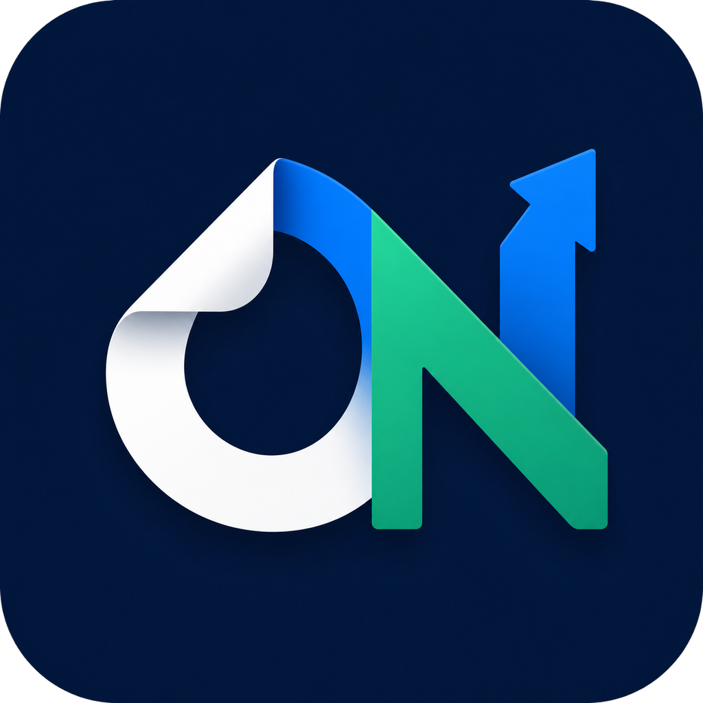
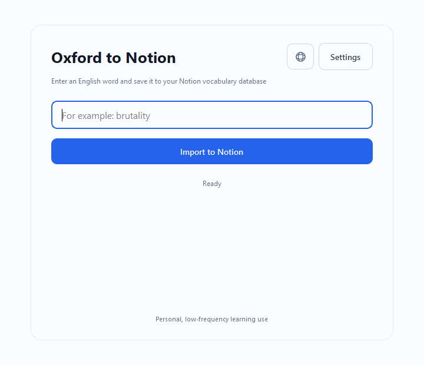

# Oxford to Notion

<p align="center">
  
</p>

Languages: [简体中文](README.md) | [English](README.en.md)

[查看更新日志](CHANGELOG.md)

一个输入英文单词，自动查询 Oxford Learner's Dictionaries，并保存到 Notion 单词库的 Windows 桌面工具。

A Python desktop app and CLI that imports Oxford Learner's Dictionaries entries into a Notion vocabulary database.

<p align="center">
  
</p>

桌面版提供输入框、导入按钮、设置页面和 Notion 结果链接，不需要通过 Terminal 操作。原来的 CLI 入口仍然保留。

## Windows 一键安装（推荐）

普通用户不需要安装 Python，也不需要自己构建程序：

1. 打开 [GitHub Releases](https://github.com/johnny05285514-code/oxford-to-notion/releases/latest)
2. 下载 `Oxford-to-Notion-Setup-1.4.2.exe`
3. 双击安装包，按提示完成安装
4. 从桌面或开始菜单打开 `Oxford to Notion`
5. 第一次打开时按照五步向导完成 Notion 配置和连接测试

软件右上角提供语言菜单，可随时在简体中文和 English 之间切换。选择会自动保存在本机，下次打开继续使用。

导入成功后，主界面会显示最近 5 个单词；点击即可打开对应的 Notion 页面。软件还会每天静默检查一次 GitHub 新版本，仅在发现更新时提醒，不会自动下载安装。

从 v1.4.1 开始，程序生成的 Oxford 正文会放在明确标记的管理区域内。重复导入只会替换这个区域，不会删除你在区域外添加的个人笔记。旧版本页面第一次重新导入时会保留全部旧正文并新增安全管理区域，因此 Oxford 内容可能暂时出现两份；确认新内容后可手动删除旧的 Oxford 段落。

安装包支持英文和简体中文安装界面、可选桌面快捷方式、开始菜单入口和正常卸载。卸载程序时不会自动删除你的 Notion 配置。

这是个人开源项目，安装包目前没有商业代码签名。Windows 可能显示“未知发布者”；请确认文件来自上面的官方 GitHub 仓库，并可使用 Release 中的 `.sha256` 文件核对下载内容。

## 我为什么做这个

我学英语时经常查单词，但每次都要手动复制词性、释义和例句到 Notion，过程很重复。

所以我做了这个小工具：输入一个英文单词，它会自动查询 Oxford Learner's Dictionaries，把适合学习的内容整理好，再保存到我的 Notion 单词库里。

这个项目主要是个人低频学习用途。对我来说，它也是一次把真实重复需求变成 Python 自动化程序的练习。

## 适合谁

适合：

- 想把英文单词整理到 Notion 的人
- 想使用普通 Windows 窗口而不是命令行的人
- 愿意跟着步骤配置 Notion Integration 的人

不太适合：

- 想批量抓取大量单词的人
- 想把它当成商业词典 API 使用的人

## 它能做什么

Windows 双击版里，只需要输入一个词：

```text
brutality
```

如果你喜欢命令行，也可以这样运行：

```powershell
python main.py brutality
```

程序会提取并保存：

- 单词
- 词性
- 可数 / 不可数
- 复数形式，如果页面有
- 编号释义
- 每个释义下面的例句
- Oxford 来源链接

如果同一个 `Word` 已经在 Notion 里存在，程序会更新原来的页面，不会重复创建。

## 从源代码运行

### 1. 安装 Python

需要 Python 3.11 或更新版本。

### 2. 下载项目

可以用 Git clone，也可以直接在 GitHub 页面点 `Code` → `Download ZIP`。

### 3. 安装依赖

Windows 用户推荐直接双击：

```text
setup.bat
```

它会自动创建 `.venv`、安装依赖，并在没有 `.env` 时从 `.env.example` 复制一份。

如果你更习惯命令行，也可以手动运行：

```powershell
python -m venv .venv
.\.venv\Scripts\Activate.ps1
python -m pip install -r requirements.txt
```

### 4. 配置 Notion

推荐方式：直接 Duplicate 这个 Notion 模板：

[Oxford to Notion Vocabulary Template](https://impartial-chicken-d5f.notion.site/39362946376780deb3d2f6986fef3c4a?v=39362946376780878dde000c78112f24&source=copy_link)

打开链接后，点击右上角的 `Duplicate`，复制到你自己的 Notion workspace。这样数据库字段会自动准备好。

如果你想自己手动创建数据库，也可以按下面的字段配置。

你需要：

1. 创建一个 Notion Internal Integration
2. 复制它的 token
3. 把 Integration 连接到你的 Notion 数据库
4. 准备好下面这些数据库字段

| 字段名 | Notion 类型 |
|---|---|
| `Name` | Title |
| `Word` | Rich text |
| `Part of Speech` | Select |
| `Countability` | Rich text |
| `Plural Form` | Rich text |
| `Definitions` | Rich text |
| `Examples` | Rich text |
| `Source URL` | URL |
| `Added Date` | Date |

### 5. 配置 Notion 凭据

桌面版第一次打开时会自动显示五步配置向导：

1. 复制 Notion 数据库模板
2. 创建并连接 Notion Integration
3. 粘贴 Integration Token
4. 粘贴数据库 URL
5. 测试 Token、数据库权限和字段结构

测试成功后点击“保存并开始使用”。Token 会保存在当前 Windows 用户的 AppData 中，不会打包进 `.exe`，也不会上传到 GitHub。

以后也可以从“设置”页面重新打开向导，或者直接点击“测试连接”。需要填写的内容仍然是：

- Notion Integration Token
- Notion 数据库 URL 或 Database ID

如果你使用 CLI，也可以继续配置 `.env`：

如果你运行过 `setup.bat`，它会自动帮你创建 `.env` 文件。

如果没有自动创建，也可以手动复制：

```powershell
Copy-Item .env.example .env
```

然后用记事本打开 `.env`：

```powershell
notepad .env
```

把里面改成你自己的 Notion 配置：

```dotenv
NOTION_TOKEN=你的 Notion Integration Token
NOTION_DATABASE_ID=你的 Notion 数据库链接或 ID
```

例如：

```dotenv
NOTION_TOKEN=粘贴你的 Notion Integration Token
NOTION_DATABASE_ID=https://www.notion.so/your-workspace/your-database-url
```

说明：

- `NOTION_TOKEN` 从 Notion Integration 页面复制
- `NOTION_DATABASE_ID` 推荐直接复制 Notion 数据库页面的浏览器地址
- 程序会自动从 Notion URL 里提取数据库 ID
- `.env` 只保存在你自己的电脑里

不要把 `.env` 上传到 GitHub。里面有你的私人 token。

### 6. 运行桌面版

安装依赖后，可以先直接打开窗口：

```powershell
.\.venv\Scripts\pythonw.exe gui.py
```

要生成一个没有 Terminal 窗口的 Windows `.exe`，双击：

```text
build_app.bat
```

生成完成后，桌面程序位于：

```text
dist\Oxford to Notion.exe
```

然后双击 `install_app.bat`，程序会安装到当前 Windows 用户的应用目录，并在桌面创建 `Oxford to Notion` 快捷方式。

如果你安装了 NSIS，也可以双击 `build_installer.bat` 生成可分发的完整安装包。输出位于 `release\`。

### 7. 使用命令行版（可选）

原来的 Windows 双击版仍然可用：

```text
Oxford to Notion.bat
```

然后只输入单词：

```text
brutality
```

命令行用户也可以运行：

```powershell
python main.py brutality
```

成功时会看到类似：

```text
Imported 'brutality': https://app.notion.com/...
```

## Windows 双击运行

第一次使用时，先双击：

```text
setup.bat
```

如果使用桌面 GUI，运行 `build_app.bat` 后双击 `dist\Oxford to Notion.exe`。

如果使用原来的 CLI，配置好 `.env` 后再双击：

```text
Oxford to Notion.bat
```

`Oxford to Notion.bat` 会连续让你输入单词；输入 `q` 或直接空回车退出。

## 常见问题

### 这算爬虫吗？

严格说，它是一个低频网页解析工具：用户输入一个词，程序请求一个 Oxford 页面并提取必要学习字段。

它不适合批量抓取，也不会绕过验证码、Cookie、JavaScript challenge 或访问限制。

### 会不会重复创建同一个单词？

不会。程序会用 Notion 里的 `Word` 字段判断是否已经存在。

如果存在，就更新原页面；如果不存在，才创建新页面。

### 为什么我运行失败？

常见原因：

- `.env` 没配置好
- Notion Integration 没有连接到数据库
- Notion 数据库字段名或类型不对
- 网络访问 Oxford 或 Notion API 失败
- Oxford 没有这个单词
- Oxford 返回了访问挑战页面

### 可以分享给别人吗？

可以分享代码，但不要分享你自己的 `.env`。

朋友需要用他们自己的：

```dotenv
NOTION_TOKEN=their_notion_integration_token
NOTION_DATABASE_ID=their_notion_database_id
```

## 测试

运行：

```powershell
python -m pytest -q
```

测试不会访问真实 Oxford，也不会修改真实 Notion 数据库。

## 项目结构

```text
gui.py              Windows 桌面界面入口
setup_wizard.py     首次配置向导
notion_connection.py 只读连接和字段检查
main.py             命令行入口
import_service.py   桌面版和 CLI 共用的导入流程
settings_store.py   桌面版本地设置
config.py           读取 .env 配置
oxford_client.py    请求 Oxford 页面
parser.py           解析 HTML
notion_writer.py    写入或更新 Notion
models.py           数据结构
exceptions.py       错误类型
tests/              测试
```

如果 Oxford 页面结构变了，通常优先看 `parser.py`。

## 注意

This project is not affiliated with Oxford University Press, Oxford Learner's Dictionaries, or Notion.

Please use it for personal, low-frequency learning only.
